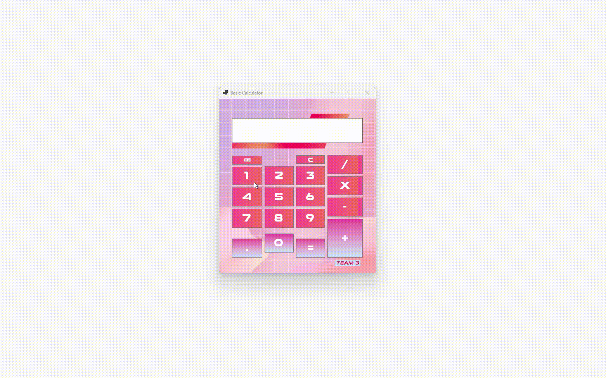

  

# 📐 BASIC CALCULATOR

**Lab 4 - CS 222: Advanced Object-Oriented Programming**

---

## 📌 Project Description and Features

The Basic Calculator is a Windows Form-based application that provides essential arithmetic operations with an intuitive input interface. It supports clearing entries, decimal calculations, and displays results in real time.

---

## ✨ Features

- 🆑 **C (Clear):** Clears the last entered number or operation.  
- 🔙 **CE (Clear Entry):** Resets the entire current calculation.  
- ➕ **Addition**  
- ➖ **Subtraction**  
- ✖️ **Multiplication**  
- ➗ **Division**  
- ➰ **Decimal Point:** Allows floating-point calculations.  
- 📟 **Display:** Shows the current input, operations, and results.

---

## ▶️ Instructions on Running the App

1. Open the project in Visual Studio or your preferred C# IDE.  
2. Press `F5` or run the application.  
3. Use the menu and click on the keys to:  
   - Enter digits (0–9)  
   - Press `.` for decimal point  
   - Use `+`, `-`, `*`, `/` for operations  
   - Press `CE` to clear all  
   - Press `C` to clear the last entry  
   - Press `=` to calculate and display the result  
   - Choose **Exit** to close the calculator  

---

## 👨‍💻 Team Members

- Balmes, Genrique Sean Arkin D.  
- Gonda, Paul Raimiel C.  
- Rivera, Irish D.  
- Sta. Teresa, David Kalel D.

---

## 🧪 Sample Output

  

---

## 🙏 Acknowledgement

Special thanks to our CS 222 instructor, **Ms. Fatima Marie P. Agdon**, for guiding us in our AOOP Course.
